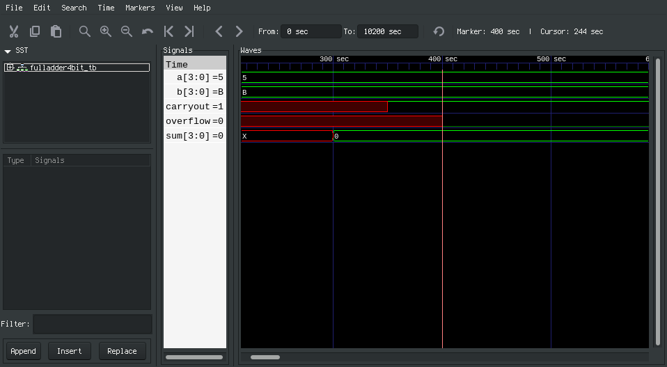

# Lab0

# Timing/Waveform
The tables for the amount of gates each input passes through to reach each output are shown below:

The half adder is

|       | A | B |
|-------|---|---|
| Sum   | 1 | 1 |
| Carry | 1 | 1 |

The full adder is

|       | A | B | C |
|-------|---|---|---|
| Sum   | 2 | 2 | 1 |
| Carry | 3 | 3 | 2 |

Therefore, the 4-bit adder is:

|    | A/B0 | A/B1 | A/B2 | A/B3 |
|----|------|------|------|------|
| S0 | 1    |      |      |      |
| C0 | 1    |      |      |      |
| S1 | 2    | 2    |      |      |
| C1 | 3    | 3    |      |      |
| S2 | 4    | 4    | 2    |      |
| C2 | 5    | 5    | 3    |      |
| S3 | 6    | 6    | 4    | 2    |
| C3 | 7    | 7    | 5    | 3    |
| O  | 8    | 8    | 6    | 4    |

The amount of gates in the critical path for an n-bit adder is 2n, as the overflow bit is one xor gate from the carryout, and the carryout follows a pattern of 2n - 1 from the table.

When deciding a wost-case delay test case, it is important to note that the carry bits all require either an AND from the halfadder level.
Of the two halfadders used in the fulladders, the first one (`h0` in `fulladder.v`) can be driven by the inputs in the bus from the beginning.
However, the second halfadders (`h1` in `fulladder.v`) requires a carry bit from the preceding adder.
If the carry bit is 0, there is no need to wait for the result of `h0` because to the annihilation of ands will cause the half-adder to output a carry of 0 allowing any gate relying on this output to be 'early'.
Therefore, to test the maximum propagation delay, begin with a case in which there is always a carry of 1 for the fulladders and then check the time until the last signal is driven from X, as shown below:

Since each gate has a delay of 50 time units, the maximum propagation delay, present on the overflow signal, is 400, which agrees with the table above (8 * 50 = 400).
The sum and carry outputs also agree at 6 * 50 = 300 and 7 * 50 = 350 respectively.

# Test cases
There are two signed inputs and three outputs to test.
Therefore, we sought to test nonnegative and negative for both inputs and outputs, creating 6 possible cases.
We test each of these for a theoretical carry and overflow, creating 6 * 2 * 2 = 24 test cases.
However, it is impossible to design a case where two nonnegative numbers add and have a carry bit, a case where two negative numbers and have no carry bit, or a case where a nonnegative/negative set of inputs overflow.
A case with a nonnegative and negative input with a nonnegative sum without a carry or a nonnegative and negative creating a negative sum with a carry is also impossible.
That makes for 24 - 2 - 2 - 8 - 2 - 2 = 8 test cases.
Because this requires 16 inputs, we use every signed 4-bit number exactly once in the inputs of these test cases.
The remaining 8 test cases are "extreme" test cases, such as 7 + 0, 7 - 8, 0 - 8, 0 + 0.

- Test case 0: Always carry to demonstrate maximum propagation delay.
- Test case 1: inputs nonnegative, sum nonnegative, overflow, no carry: 5 + 3
- test case 2: inputs nonnegative, sum nonnegative, no overflow, no carry: 4 + 1
- Test case 3: nonnegative and negative inputs, sum nonnegative, no overflow, carry: 2 - 1
- Test case 4: nonnegative and negative inputs, sum negative, no overflow, no carry: 6 - 7
- Test case 5: negative and nonnegative inputs, sum nonnegative, no overflow, carry: -2 + 7
- Test case 6: negative and nonnegative inputs, sum negative, no overflow, no carry: -5 + 0
- Test case 7: negative inputs, sum negative, overflow, carry: -8 - 6
- Test case 8: negative inputs, sum negative, no overflow, carry: -4 - 3
- Test case 9: Extreme case 1: 7 + 7
- Test case 10: Extreme case 2: 7 + 0
- Test case 11: Extreme case 3: 7 - 8
- Test case 12: Extreme case 4: 0 - 8
- Test case 13: Extreme case 5: -8 - 8
- Test Case 14: Extreme case 6: -8 + 7
- Test case 15: Extreme case 7: 0 + 0

# Test Bench Failures and Explanation
The logic was correct the entire time.
However, the failures which did occur was the use of `$monitor` without a enough of a delay for a stable signal, and so the last results to print for a given combination of inputs were incorrect.
The design change was to estimate the timing of each chip to find a reasonable delay to put in the test bench (this was done before making the tables in the above Timing/Waveform section):

- halfadder: 50 time units, because the sum and carry bits are independent and computed by a single basic gate.
- fulladder: 150 time units, because the carry bit requires components from two halfadders (linked by an intermediate sum) and an XOR.
- adder: 550 time units, because the overflow bit requires information from a sequence of 1 halfadder, 3 fulladders, and an XOR.

Because the adder was estimated to have a maximum propagation delay of 550 time units, we changed a delay of 100 time units to a delay of 600 time units to observe the stable signal for 50 time units.

To verify the outputs and catch errors, we manually found the desired sum, carry, and overflow outputs and put them in buses.
Afterwards, we iterated through the buses to display a caught error as well as the desired output.
Behavioral verilog could have given us a sum without needing a hard code, but the carry and overflow bits would have been tricky to do without hardcoding.
Since there are only 16 test cases, we decided to hardcode everything.

# Testing performed on the FPGA board
We used the switches and the operator input button to set hte inputs and checked the corresponding LEDs for the correct output.
These tests came out as successful, as shown below for 5 + 3 (overflow):

# Summary Statistics

Of the avialable resources, this was our usage

|       | Avialable | Used |
|-------|---        |---   |
| LUT   | 17600     |   7  |
| IO    |   100     |  13  |
| FF    | 35200     |   9  |
| BUFG  |    32     |   1  |

So we used 7 of the 17600 available look up tables, 13 of the 100 IOs, 9 of the 35200 FFs and 1 of the 32 clocks.
From this we can see that our full addder was a very simple piece and there is much more that can be implemented on the FPGA.
